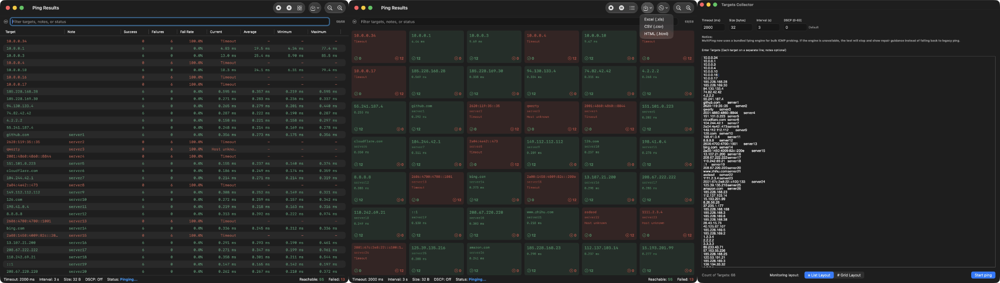

# MultiPing for macOS

MultiPing is a lightweight macOS network monitoring utility for pinging many targets at once. It is designed for network engineers, IT administrators, and power users who need a fast visual overview of host reachability, packet loss, and latency across IPv4, IPv6, and domain-name targets.



---

## Highlights

- **Bulk ICMP probing** with a bundled `fping` engine instead of launching one `ping` process per target.
- **IPv4, IPv6, and domain-name targets** can be monitored in the same session.
- **Per-target notes** make large target lists easier to read and export.
- **List and Grid layouts** can be switched while monitoring is still running.
- **Live filtering** by target, note, status, or target type.
- **Latency statistics** for current, average, minimum, and maximum response time.
- **DSCP marking** support for QoS testing.
- **Export results** to CSV, HTML, or Excel-compatible `.xls` files.

---

## Features

### Target input

Enter one target per line. Notes are optional and can be separated from the target by a comma, tab, or space.

```text
10.0.0.1
8.8.8.8 public-dns
2001:db8::1, lab-ipv6-gateway
example.com web-test
```

Supported target types:

- IPv4 addresses
- IPv6 addresses
- Domain names

MultiPing remembers the last target list, so repeated checks can be restarted quickly.

### Probe settings

The target collector supports:

- **Timeout** in milliseconds
- **Packet size** in bytes
- **Interval** in seconds
- **DSCP** value from `0` to `63`

The app validates the settings before each run. The interval is automatically adjusted so it remains longer than the timeout window. DSCP values are shown with common labels where applicable, including `CS1`, `CS3`, `AF41`, `EF`, and `CS7`.

### Monitoring layouts

MultiPing provides two result views:

#### List Layout

The List Layout uses a native macOS table and is best for detailed monitoring and troubleshooting.

Available columns include:

- Target
- Note
- Success count
- Failure count
- Failure rate
- Current latency
- Average latency
- Minimum latency
- Maximum latency

Columns can be resized and reordered, and the column order is persisted between runs.

#### Grid Layout

The Grid Layout is optimized for high-density visual monitoring. Each card shows the target, optional note, latest status or response time, success count, and failure count.

Grid results can be sorted by:

- Target
- Success count
- Failure count

### Filtering, sorting, and zooming

Both layouts include a live filter bar. Filtering matches target values, notes, status text, and target type.

The result views also support:

- Sorting by key result fields
- IPv4-aware target sorting
- Zoom in and zoom out for dense screens
- Reachable and failed counters in the status bar

### Session controls

During a monitoring session you can:

- Start pinging
- Pause
- Resume
- Stop and clear results
- Switch between List and Grid layouts
- Export the currently displayed results

### Export

Results can be exported from either layout as:

- **Excel-compatible `.xls`**
- **CSV**
- **HTML**

Exported fields include target, type, note, current latency, average latency, minimum latency, maximum latency, success count, failure count, failure rate, and status.

---

## Engine and reliability

MultiPing v1.4 uses a bundled `fping` helper for bulk ICMP probing. IPv4/domain targets and IPv6 targets are processed in separate `fping` batches, improving efficiency for larger target sets.

The app intentionally does not silently fall back to the legacy system `ping` command. If the bundled engine is missing, not executable, or returns a fatal error, MultiPing stops the test and displays repair guidance instead of showing misleading results.

Additional reliability behavior:

- Automatic retry when the `fping` process times out
- Clear engine-unavailable status when probing cannot continue
- Safer shutdown when closing result windows or quitting the app
- Historical latency statistics are preserved across temporary failures during a session

---

## How to run from source

1. Clone or download this repository.
2. Open `MultiPing.xcodeproj` in Xcode.
3. Select the **MultiPing for macOS** target.
4. Build and run the app.
5. Enter targets, choose a layout, and click **Start ping**.

The current project targets **macOS 13.5 or later**. Because the project file uses modern Xcode project structure, **Xcode 16 or later is recommended** for opening and building the current source tree.

---

## Release app notes

If you launch a downloaded release build and macOS blocks it, open:

**System Settings → Privacy & Security**

Then choose **Open Anyway** for MultiPing.

Do not remove the bundled `fping` file from the app package. MultiPing depends on it for ICMP probing.

---

## Requirements

- macOS 13.5 or later
- Apple Silicon or Intel Mac
- Bundled `fping` helper included in the app resources

---

## Third-party component

MultiPing includes a bundled `fping` helper for ICMP probing. See `MultiPing/fping_LICENSE.txt` for the bundled helper license.

---

## Acknowledgements

Special thanks to Gemini, Codex, GPT-o3, and GPT-o4-mini-high for their support and contributions during the development of this project.
